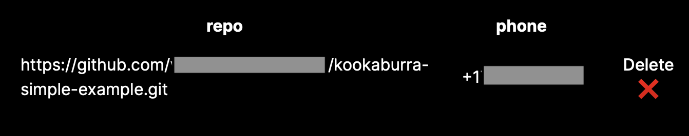

# Welcome to Kookaburra

Let users send text messages with your [Langchain](https://langchain.readthedocs.io/en/latest/) app. You can deploy a Langchain app with Kookaburra in just 3 steps:

1. Create your Kookaburra project repo on GitHub.
2. Add the Kookaburra GitHub app to your project.
3. Push to the repo.

And you're live! See more details on each step below.

## Quickstart

### Create your Kookaburra project repo on Github
Create a Github repository for your Kookaburra project. The easiest way to do that is to copy the Kookaburra simple example template: [https://github.com/kookaburracodes/kookaburra-simple-example](https://github.com/kookaburracodes/kookaburra-simple-example).

Your repository should have the following layout:

    your-github-repo/
        kookaburra.py      # The main file containing your Langchain llm

The only required file is `kookaburra.py`, which is where your Langchain project will run from. All you need to implement is the `get_llm()` function, as shown below

```
from langchain.llms import OpenAI


def get_llm() -> OpenAI:
    return OpenAI(temperature=0.9)
```

The `get_llm()` function can return either an [LLM](https://langchain.readthedocs.io/en/latest/modules/llms.html) or [Chain](https://langchain.readthedocs.io/en/latest/modules/chains.html). For more details on how to create a chain, please check out the [Langchain docs](https://langchain.readthedocs.io/en/latest/).

### Add the Kookaburra Github app to your project
If you haven't signed up for Kookaburra, follow the instructions [here](#signing-up-for-kookaburra).

If you are off the waitlist, you can add the [Kookaburra Github app](https://github.com/apps/kookaburra-codes) to your project. Go to `your-github-repo > Settings > GitHub Apps`. You should see the `kookaburra-codes` app installed here.

If you do not see the app installed, you will need to give the GitHub App access to your repository. You can do this by going to your account's GitHub settings: `settings > Applications > kookaburra-codes > Configure`. On this page, you need to give the application access to your Kookaburra repository.

Navigate back to `your-github-repo > Settings > GitHub Apps` and you should now see the `kookaburra-codes` app installed.

### Push to the repo
After installing the Kookaburra app, just push your code to `main` and voila! The Kookaburra app will be running.

Navigate back to [app.kookaburra.codes](https://app.kookaburra.codes) and you should see a list of your live projects:


You can now text the phone number under your project!


## Signing up for Kookaburra
You can sign up for Kookaburra using Github auth at the application url: [app.kookaburra.codes](https://app.kookaburra.codes).

If you see the image below, congrats! You are off the waitlist.


If you are not yet off the waitlist, please be patient! We just launched, and we're still ironing out some of the details.

Give us a follow an [Twitter](https://twitter.com/Kookaburracodes) and tweet at us to be moved to the top of the waitlist.


## Installing custom packages

You can install custom packages by creating a `requirements.txt` file or a `pyproject.toml` file in the top-most level of your project. Kookaburra will automatically install the packages specified in one of these files if they are present in your repository. If you include both, only `requirements.txt` will be used.

For example:

    your-github-repo/
        kookaburra.py      # The main file containing your Langchain llm
        requirements.txt   # A file containing the packages to install

If you need to specify additional packages like `git` or `cmake` in order to build certain python packages, include those in a file named `apt_install.txt`. Kookaburra will automatically install the packages specified in this file if it is present in your repository. This happens before any additional python packages are installed.

For example:

    your-github-repo/
        kookaburra.py      # The main file containing your Langchain llm
        requirements.txt   # A file containing the packages to install
        apt_install.txt    # A file containing the packages to install with apt

## FAQs
We just went live, so this section is still a WiP!
